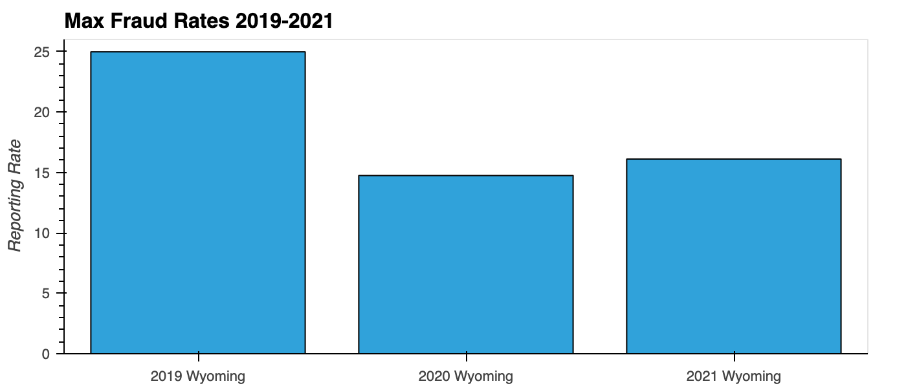
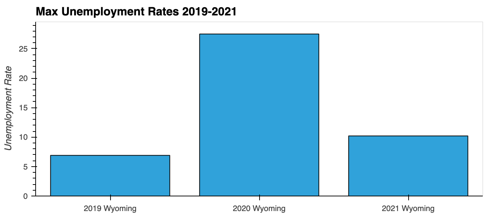

# Project-1
## Introduction:
In recent years, the Financial Crimes Enforcement Network ('FinCEN'), issued several advisories letters to financial institutions to remain vigilant of fraud schemes. 

As team, we wanted to analyze the number of fraud reports submitted to FinCEN in 2019 - 2021. Additionally, we wanted to identify if there was a direct correlation between the number of fraud reports and unemployment rates. 

## Data Soures:
### Financial Crimes Enforcement Network (FinCen) Suspicious Activity Reports (SARs)
Financial Institutions include banks, insurance companies, crypto exchanges and money service business. Non-Financial institutions including casinos and art dealers report suspicious activity to FinCEN. We were able to download filtered CSV files dircetly from Fincen's SARs website: [https://www.fincen.gov/reports/sar-stats](https://www.fincen.gov/reports/sar-stats). In the filters, we included all Industries, specifically we looked at Fraud for Suspicious Activity Type, and included all the states. We created separate files for each year. Those files can be found in the [FInCen CSV Data/](FInCen CSV Data/) folder.

### The Bureau of Labor Statistics' (BLS) Public Data Application Programming Interface (API)
To gather the unemployment rates we used The Bureau of Labor Statistics' (BLS) Public Data Application Programming Interface (API). Specifcally we were interested in Local Area Unemployment Statistics. More details an how we gathered the data can be found the [final_bls_data.ipynb](final_bls_data.ipynb) file.

## Analysis:
Banks and Financial Institutions reported the highest fraud instances, for each year, with the most reported in 2019. The State of  Wyoming had the highest reports of fraud for all years combined. We created various visuals to be able to analyze our data. In conclusion, we compared the max fraud rate to the max unemployment rates:        Another visualization we wanted to experiment with was a Heatmap. However, since populations wasn't accounted for we saw that this heat map showed darker along the east-coast just because there were more data point close together rather than larger percentages. More documentation for how we implemented that can be founf in the[final_unemployment.ipynb](final_unemployment.ipynb) file

### Conclusion:
The main goal of our project was to try and find correlation between unemployment and fraud rates. Our research and analysis showed that there doesn’t seem to be a correlation between these two variables during the years we have analyzed. Even though we have a very significant spike in unemployment from 2019 to 2020, and an equally drastic decline from 2020 to 2021, a similar movement doesn’t seem to exist in fraud reports. Further research with a larger set of years to compare may show a different picture in terms of long-term movement, but our current dataset does not support our initial assumptions.

